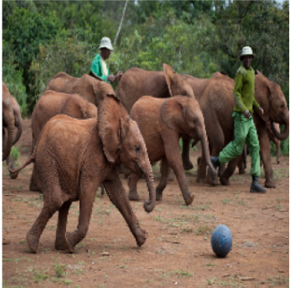
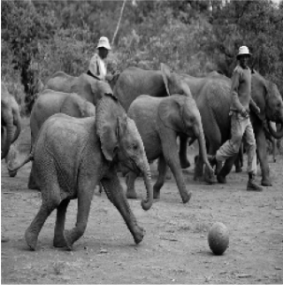
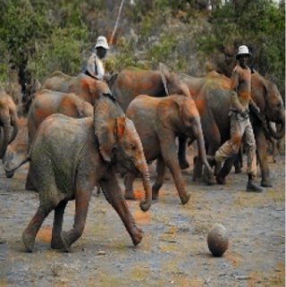
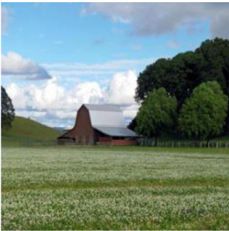
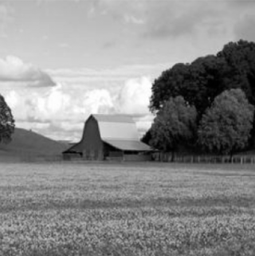
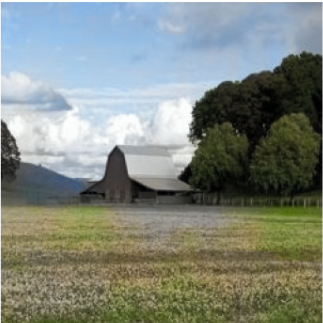
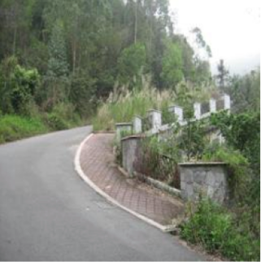
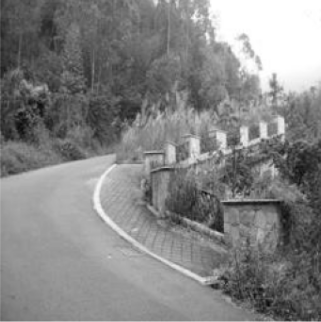
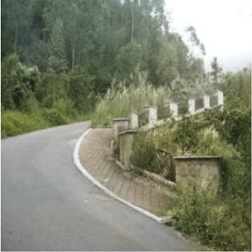

#  Image Colorization using Deep Learning

##  Overview

This project focuses on **automatic image colorization** using deep learning.
Given a grayscale image (L channel), the model predicts the corresponding color channels (a, b) in the LAB color space.

We explore multiple architectures and progressively improve performance:

* Autoencoder (Baseline)
* U-Net
* ResNet U-Net + Perceptual Loss (Final Model)

A **Streamlit web app** is also developed to allow users to upload images and view real-time colorization results.

---

## Problem Statement

Colorizing grayscale images is an inherently ambiguous task—multiple valid color mappings may exist for a single image.
The goal is to generate **visually realistic and semantically consistent colors**.

---

## Dataset Creation

We constructed a **diverse dataset (52500 images)** by combining:

### 1. COCO Subset (Custom Filtered)

Selected images from COCO dataset using specific categories:

```python
categories = {
    "people": ["person"],
    "vehicles": ["car", "bus", "truck"],
    "animals": ["dog", "cat", "horse"],
    "objects": ["chair", "bottle", "cup"]
}
```

* ~4000 images per category
* Ensures object diversity and semantic richness

---

### 2. Places365 Dataset

* Scene-centric dataset
* Adds environmental diversity (indoor, outdoor, landscapes)

---

### Final Dataset

* Combined COCO + Places365
* Total images: 52500
* Balanced across objects and scenes

---

##  Data Preprocessing

* Convert RGB → LAB color space
* Input: **L channel (grayscale)**
* Target: **a, b channels (color)**
* Normalization:

  * L ∈ [0, 1]
  * ab ∈ [-1, 1]
* Resize to 256×256

---

##  Models Implemented

### 1. Autoencoder (Baseline)

* Simple encoder-decoder
* Learns basic color mapping
* Output often blurry and desaturated

---

### 2. U-Net

* Encoder-decoder with skip connections
* Preserves spatial details
* Improved structure and color consistency

---

### 3. ResNet U-Net (Final Model)

* Encoder: ResNet-34 (pretrained)
* Decoder: U-Net style
* Loss:

  * L1 Loss
  * Perceptual Loss (VGG)

 Produces **sharper, more realistic colors**

---

##  Evaluation Metrics

We evaluate models using:

* **PSNR (Peak Signal-to-Noise Ratio)** → pixel-level accuracy
* **SSIM (Structural Similarity Index)** → perceptual similarity

---

### Results

| Model        | PSNR   | SSIM   |
| ------------ | ------ | ------ |
| Autoencoder  | 29.15    | 0.958     |
| U-Net        | 20.84     | 0.915     |
| ResNet U-Net | **31.32** | **0.983** |


## Analysis of Results

The observed results highlight important differences between model architectures and loss functions in image colorization.

### 🔹 Autoencoder (Baseline)

* Achieves relatively high PSNR and SSIM
* Tends to produce **smooth and averaged color predictions**
* This improves pixel-level similarity but results in:

  * Blurry outputs
  * Less vibrant and less realistic colors

 While metrics are strong, **visual quality is limited**

---

###  U-Net

* Performs lower than expected in this setup
* Possible reasons:

  * More complex architecture requiring more training
  * Use of only **L1 loss**, which encourages averaging
  * Lack of perceptual understanding of textures and semantics

 Leads to:

* Lower PSNR and SSIM
* Less consistent and less accurate colorization

---

###  ResNet U-Net (Final Model)

* Achieves the best performance across both metrics
* Key improvements:

  * **Pretrained ResNet-34 encoder** → strong feature extraction
  * **Perceptual loss (VGG)** → enhances texture and realism
  * Better semantic understanding of objects and scenes

Results in:

* Sharper outputs
* More realistic and vibrant colors
* Higher perceptual similarity (SSIM)

---

##  Important Insight

> **Higher PSNR does not always imply better visual quality.**

* Autoencoder achieves higher PSNR due to smoother predictions
* ResNet U-Net produces more realistic images, reflected in higher SSIM

 For image colorization, **SSIM and visual quality are more important than PSNR alone**

---

##  Conclusion

The **ResNet U-Net with perceptual loss** provides the best balance between:

* Pixel accuracy
* Structural consistency
* Visual realism

This demonstrates the importance of:

* Using pretrained encoders
* Incorporating perceptual loss
* Evaluating beyond simple pixel-wise metrics


---

##  Results & Comparisons

### 🔹 Autoencoder Results

| Original                                | Grayscale                           | Output                                |
| --------------------------------------- | ----------------------------------- | ------------------------------------- |
|  |  |  |

---

### 🔹 U-Net Results

| Original                         | Grayscale                    | Output                         |
| -------------------------------- | ---------------------------- | ------------------------------ |
|  |  |  |

---

### 🔹 ResNet U-Net Results (Final)

| Original                           | Grayscale                      | Output                           |
| ---------------------------------- | ------------------------------ | -------------------------------- |
|  |  |  |

---

##  Streamlit Web App

We built an interactive UI using Streamlit:

### Features:

* Upload image
* View original vs colorized output
* Download result
* Clean and responsive UI

---

##  How to Run

###  1. Install dependencies

```bash
pip install -r requirements.txt
```

---

###  2. Run Streamlit App

```bash
streamlit run app/app.py
```
---

###  3. Train Models

```bash
python src/train_autoencoder.py
python src/train_unet.py
python src/train_resnet_unet.py
``` 

###  4. Evaluate Models

```bash
python src/evaluation.py
```

## Project Structure

```
app/        → Streamlit UI  
src/        → Training + models  
model_pth/     → Saved weights  
```

---

## Key Learnings

* Importance of dataset diversity in colorization
* Limitations of pixel-wise losses (L1)
* Role of perceptual loss in improving realism
* Trade-off between accuracy and visual quality

---

## Future Improvements

* GAN-based colorization (Pix2Pix)
* Attention U-Net
* Higher resolution outputs
* Video colorization

---

##  Author

Anuraj Gogoi

---

